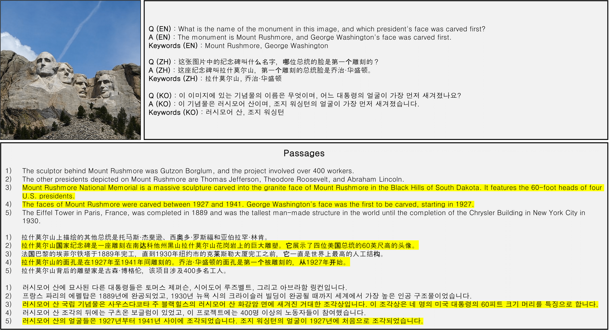
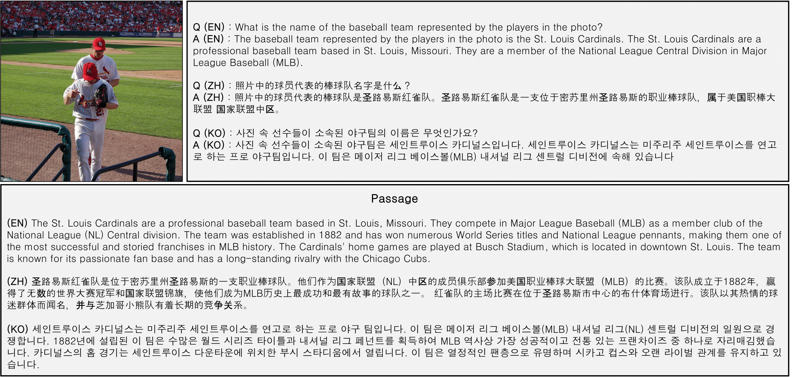

# VLR-Bench
**Multilingual Benchmark Dataset for Vision-Language Retrieval Augmented Generation**  
🏆 **Benchmark for Utility of Retrieved Documents**  
📌 **COLING 2025**  

## 📢 Authors  
🟨 [Hyeonseok Lim](https://github.com/lhsstn/)  
🟨 [Dongjae Shin](https://github.com/faizman31/)  
🟨 [Seohyun Song](https://github.com/kreamsoup-SH)  
🟨 [Inho Won](https://github.com/kotmul)  
🟨 [Minjun Kim](https://github.com/mjkmain)  
🟪 [Junghun Yuk](https://github.com/Swalbak)  
🟪 [Haneol Jang](https://sites.google.com/view/aim-lab-hbnu/)  
🟨 [KyungTae Lim](https://github.com/jujbob)  

**Affiliations**:  
🟨 **Seoul National University of Science and Technology**  
🟪 **Hanbat National University**  

---

## 🔗 Links  

- 🗒️ **[VLR-Bench Blog](https://vlr-bench.github.io/)**  
- 📄 **[arXiv](https://arxiv.org/abs/2412.10151)**
- 🎓 **[COLING 2025](https://aclanthology.org/2025.coling-main.411/)**
- 📂 **[VLR-IF Dataset (HuggingFace)](https://huggingface.co/datasets/MLP-KTLim/VLR-IF)**
- 📂 **[VLR-Bench Dataset (HuggingFace)](https://huggingface.co/datasets/MLP-KTLim/VLR-Bench)**

---

## 📖 Abstract  

1. **VLR-Bench**
   - We propose VLR-BENCH, a visual question answering (VQA) benchmark for evaluating vision-language models (VLMs) using retrieval-augmented generation (RAG).
   - VLR-BENCH includes five input passages, allowing models to determine which passage is most relevant for answering a query—an aspect often overlooked in prior research.
     
2. **VLR-IF**
   - We introduce VLR-IF, a dataset of 32,000 instruction-following examples to enhance VLMs' ability to generate accurate responses from retrieved information.
     
3. **Open-Source**
   - Both VLR-BENCH and VLR-IF datasets are publicly available online.

---

## 📊 VLR-Bench Dataset  

📌 **Dataset Summary**  
- **150 images** from BOK-VQA  
- **150 images** from Wikimedia Commons (reflecting cultural elements)  
- **Multilingual Parallel Corpus:** English, Chinese, and Korean  
- 📂 **[Dataset Link](https://huggingface.co/datasets/MLP-KTLim/VLR-Bench)**  

📷 **Example Images from VLR-Bench**  

  

---

## 📊 VLR-IF Dataset  

📌 **Dataset Summary**  
- **9,000 images** from COCO  
- **32,000 entries** (valid/invalid passages)  
- **Languages:** English, Chinese, Korean  
- 📂 **[Dataset Link](https://huggingface.co/datasets/MLP-KTLim/VLR-IF)**  

📷 **Example Images from VLR-IF**  

  

---

## 📜 BibTeX  
```bibtex
@article{lim2024vlr, title={VLR-Bench: Multilingual Benchmark Dataset for Vision-Language Retrieval Augmented Generation}, author={Lim, Hyeonseok and Shin, Dongjae and Song, Seohyun and Won, Inho and Kim, Minjun and Yuk, Junghun and Jang, Haneol and Lim, KyungTae}, journal={arXiv preprint arXiv:2412.10151}, year={2024} }

@inproceedings{lim-etal-2025-vlr, title = "{VLR}-Bench: Multilingual Benchmark Dataset for Vision-Language Retrieval Augmented Generation", author = "Lim, Hyeonseok and Shin, Dongjae and Song, Seohyun and Won, Inho and Kim, Minjun and Yuk, Junghun and Jang, Haneol and Lim, KyungTae", booktitle = "Proceedings of the 31st International Conference on Computational Linguistics", month = jan, year = "2025", publisher = "Association for Computational Linguistics", url = "https://aclanthology.org/2025.coling-main.411/" }
```

---

## 📢 Acknowledgement  

This work was supported by:  
- **Institute of Information & Communications Technology Planning & Evaluation (IITP)**  
- **Artificial Intelligence Industrial Convergence Cluster Development Project**  

### ⚠️ Usage and License Notices  
- The **data and code** are intended and licensed for **research use only**.  
- They must comply with the **license agreement of GPT-4**.  
- The dataset is released under **CC BY NC 4.0** (**non-commercial use only**).  
- Models trained using this dataset should **not be used for non-research purposes**.  

---

## 🛠 How to Use  

1. Clone this repository:  
   ```sh
   git clone https://github.com/MLP-Lab/VLR-Bench.git
   cd VLR-Bench
   ```
2. Install dependencies:
   ```
   pip install -r requirements.txt
   ```
3. Run eval
The JSON file containing the inference results of the model to be evaluated must include the following values:

'result': The model's inference output.
'label': The output value from MLP-KTLim/VLR-Bench.
'answer_keyword1': The keyword1 value from MLP-KTLim/VLR-Bench.
'answer_keyword2': The keyword2 value from MLP-KTLim/VLR-Bench.
   ```
   sh eval.sh
   ```

   


